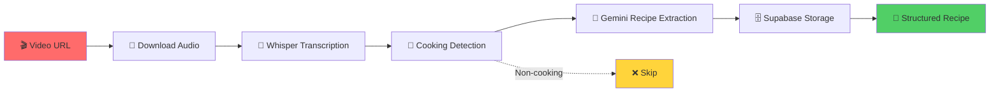

# 🍳 Resepi - AI Recipe Extractor

> **Automatically extract structured recipes from TikTok, Instagram, and YouTube cooking videos using AI! 🎬➡️📝**

Transform any cooking video into a structured recipe with just a URL! This powerful pipeline uses **Whisper** for speech-to-text and **Google Gemini** for intelligent recipe extraction, specifically optimized for **Malaysian cuisine** and **Bahasa Melayu** content.


---

## ✨ Features

🎯 **Smart Video Processing**
- 📱 Support for TikTok, Instagram, YouTube, and Facebook videos
- 🎤 High-quality audio extraction with yt-dlp
- 🗣️ Advanced speech-to-text using OpenAI Whisper
- 🧠 AI-powered cooking video classification

🍜 **Malaysian-Optimized Recipe Extraction**
- 🇲🇾 Specialized for Bahasa Melayu cooking content
- 🥘 Natural language mixing (English + Malay)
- 📋 Structured ingredient parsing with quantities
- 👨‍🍳 Step-by-step cooking instructions

⚡ **Powerful Automation**
- 🔄 Batch processing of multiple URLs
- 📊 Progress tracking and retry mechanisms
- 🗄️ Supabase database integration
- 🚀 Concurrent processing with rate limiting

🛡️ **Smart & Safe**
- ✅ Automatic cooking video detection
- 🎯 Confidence-based filtering
- 📈 Comprehensive error handling
- 📝 Detailed logging and statistics

---

## 🚀 Quick Start

### 1️⃣ Installation

```bash
# Clone the repository
git clone https://github.com/danishayman/Resepi-Extractor.git
cd Resepi-Extractor

# Run the setup script
python setup_automation.py
```

### 2️⃣ Configuration

Edit the `.env` file with your API keys:

```env
# Required API Keys
GEMINI_API_KEY=your_gemini_api_key_here
SUPABASE_URL=https://your-project.supabase.co
SUPABASE_KEY=your_supabase_anon_key_here

# Optional Settings (with defaults)
WHISPER_MODEL=openai/whisper-large-v3-turbo
GEMINI_MODEL=gemini-1.5-flash
DEVICE=auto
OUTPUT_DIR=./recipes
```

**🔑 Get Your API Keys:**
- **Gemini API**: [Get it here](https://makersuite.google.com/app/apikey) (Free tier available!)
- **Supabase**: [Create project](https://supabase.com) (Free tier available!)

### 3️⃣ Setup Database

```bash
# Create database tables
python automate_recipes.py --setup

# Test your configuration
python automate_recipes.py --check-env
```

### 4️⃣ Extract Your First Recipe! 🎉

```bash
# Single video
python automate_recipes.py --url "https://www.tiktok.com/@khairulaming/video/7092671985238478106"

# Multiple videos from file
python automate_recipes.py --file sample_urls.txt
```

---

## 🎯 Usage Examples

### 🎬 Single Video Processing
```python
from recipe_extractor import RecipeExtractor

# Initialize the extractor
extractor = RecipeExtractor()

# Extract recipe from TikTok video
recipe_data, saved_path = extractor.process_video(
    "https://www.tiktok.com/@khairulaming/video/7092671985238478106"
)

print(f"✅ Recipe saved to: {saved_path}")
```

### 📚 Batch Processing
```bash
# Process with 3 concurrent workers, 10s delay between requests
python automate_recipes.py --file urls.txt --workers 3 --delay 10

# Skip video classification (process all videos)
python automate_recipes.py --file urls.txt --skip-classification

# Custom confidence threshold for cooking detection
python automate_recipes.py --file urls.txt --confidence 0.8
```

### 📊 Database Management
```bash
# View database statistics
python automate_recipes.py --stats

# Retry failed URLs from previous run
python automate_recipes.py --file urls.txt --retry
```

---

## 📁 Project Structure

```
Resepi/
├── 🎯 Core Components
│   ├── recipe_extractor.py      # Main pipeline orchestrator
│   ├── audio_processor.py       # Video download & audio extraction
│   ├── transcription.py         # Whisper speech-to-text
│   ├── recipe_parser.py         # Gemini recipe extraction
│   └── video_classifier.py      # AI cooking video detection
│
├── 🗄️ Data Management
│   ├── database_manager.py      # Supabase integration
│   ├── batch_processor.py       # Concurrent processing
│   └── config.py               # Configuration management
│
├── 🚀 Automation & Tools
│   ├── automate_recipes.py      # Main CLI automation script
│   ├── setup_automation.py     # Easy setup wizard
│   └── test.py                 # Testing & validation
│
├── 📄 Data Files
│   ├── sample_urls.txt          # Example TikTok URLs
│   ├── urls.txt                # Bulk URL collection
│   └── requirements.txt        # Python dependencies
│
└── 📋 Configuration
    └── .env                    # API keys & settings
```

---

## 🧠 How It Works



### 🔄 Processing Pipeline

1. **🎬 Video Processing**: Download audio using yt-dlp from social media platforms
2. **🎤 Speech Recognition**: Convert audio to text using Whisper (Bahasa Melayu optimized)
3. **🧠 Content Classification**: AI determines if video contains cooking content
4. **📝 Recipe Extraction**: Gemini AI structures the transcript into recipe format
5. **🗄️ Database Storage**: Save to Supabase with metadata and search capabilities

---

## 📊 Recipe Output Format

The extracted recipes follow this structured format:

```json
{
  "title": "Rendang Daging Sedap",
  "description": "Rendang daging yang sedap dan mudah untuk family dinner",
  "cuisine_type": "Masakan Melayu",
  "tags": ["spicy", "tradisional", "sedap", "comfort food"],
  "ingredients": {
    "main_ingredients": [
      {"name": "Daging lembu", "quantity": "1 kg"},
      {"name": "Santan pekat", "quantity": "2 tin"}
    ],
    "spices_and_seasonings": [
      {"name": "Cili kering", "quantity": "20 biji"},
      {"name": "Bawang merah", "quantity": "8 ulas"}
    ]
  },
  "instructions": {
    "step1": "Kisar semua bahan rempah sampai halus",
    "step2": "Panaskan minyak dan tumis rempah 10 minit",
    "step3": "Masukkan daging, gaul rata dengan rempah",
    "step4": "Tuang santan dan masak 2 jam sehingga empuk"
  },
  "video_metadata": {
    "title": "Original video title",
    "thumbnail": "https://...",
    "platform": "tiktok",
    "duration": 120
  }
}
```

---

## ⚙️ Configuration Options

### 🎛️ Environment Variables

| Variable | Default | Description |
|----------|---------|-------------|
| `WHISPER_MODEL` | `openai/whisper-large-v3-turbo` | 🎤 Whisper model for transcription |
| `GEMINI_MODEL` | `gemini-1.5-flash` | 🧠 Gemini model for recipe extraction |
| `DEVICE` | `auto` | 💻 Processing device (cpu/cuda/auto) |
| `OUTPUT_DIR` | `./recipes` | 📁 Local recipe storage directory |
| `AUDIO_QUALITY` | `192` | 🎵 Audio download quality (kbps) |
| `SKIP_CLASSIFICATION` | `false` | ⚡ Skip cooking video detection |
| `CLASSIFICATION_CONFIDENCE` | `0.7` | 🎯 Minimum confidence for cooking detection |

### 🚀 CLI Options

```bash
# Processing options
--workers 3              # Concurrent processing threads
--delay 10.0            # Delay between requests (seconds)
--retry                 # Retry failed URLs
--skip-classification   # Process all videos (no cooking detection)
--confidence 0.8        # Custom confidence threshold

# Management options
--stats                 # Show database statistics  
--setup                 # Create database tables
--check-env            # Validate configuration
```

---

## 🧪 Testing

### 🔬 Run Tests

```bash
# Complete test suite
python test.py

# Test individual components
python transcription.py          # Test Whisper
python recipe_parser.py          # Test Gemini
python video_classifier.py      # Test classification
python database_manager.py      # Test database
```

### 📝 Sample Test Data

The project includes sample URLs from popular Malaysian cooking TikTok accounts:
- `@khairulaming` - 300+ recipe videos
- Various Malaysian cuisine styles
- Mix of Bahasa Melayu and English content

---

## 📈 Performance & Scalability

### ⚡ Processing Speed
- **Single Video**: 2-5 minutes (depending on length)
- **Batch Processing**: 10-50 videos/hour (with rate limiting)
- **Concurrent Workers**: 2-5 recommended (respects API limits)

### 💾 Resource Usage
- **CPU**: Whisper transcription (can use GPU)
- **Memory**: ~2-4GB for large Whisper models
- **Storage**: ~50MB per video (audio + metadata)
- **Network**: Bandwidth for video downloads

### 🛡️ Rate Limiting & Safety
- Built-in delays between requests
- Automatic retry mechanisms
- Error handling and logging
- Respect for platform rate limits

---

## 🤝 Contributing

We welcome contributions! Here's how you can help:

### 🎯 Areas for Contribution
- 🌍 **Multi-language support** (Thai, Indonesian, Vietnamese)
- 🎨 **Web interface** for easier usage
- 📱 **Mobile app** integration
- 🧠 **Better AI prompts** for recipe extraction
- 🔧 **Performance optimizations**

### 📋 Development Setup
```bash
# Fork and clone the repository
git clone https://github.com/yourusername/resepi.git

# Create development environment
python -m venv venv
source venv/bin/activate  # or `venv\Scripts\activate` on Windows

# Install development dependencies
pip install -r requirements.txt
pip install -e .

# Run tests
python test.py
```

---

## 🐛 Troubleshooting

### ❓ Common Issues

**🔑 API Key Errors**
```bash
# Check if keys are set
python automate_recipes.py --check-env

# Test Gemini API
python -c "import google.generativeai as genai; genai.configure(api_key='your_key'); print('API OK')"
```

**🎤 Whisper Loading Issues**
```bash
# Check GPU availability
python -c "import torch; print(f'CUDA: {torch.cuda.is_available()}')"

# Use CPU if GPU fails
export DEVICE=cpu
```

**📱 Video Download Failures**
```bash
# Update yt-dlp
pip install --upgrade yt-dlp

# Check video accessibility
yt-dlp --list-formats "your_video_url"
```

**🗄️ Database Connection Issues**
```bash
# Test Supabase connection
python database_manager.py

# Verify environment variables
echo $SUPABASE_URL
echo $SUPABASE_KEY
```

### 📞 Getting Help

- 📖 **Documentation**: Check inline code comments
- 🐛 **Issues**: [GitHub Issues](https://github.com/yourusername/resepi/issues)
- 💬 **Discussions**: [GitHub Discussions](https://github.com/yourusername/resepi/discussions)
- 📧 **Email**: your-email@example.com

---

## 📄 License

This project is licensed under the MIT License - see the [LICENSE](LICENSE) file for details.

---

## 🙏 Acknowledgments

### 🛠️ Built With
- **[OpenAI Whisper](https://github.com/openai/whisper)** - Speech recognition
- **[Google Gemini](https://ai.google.dev/)** - Language model for recipe extraction
- **[yt-dlp](https://github.com/yt-dlp/yt-dlp)** - Video downloading
- **[Supabase](https://supabase.com/)** - Database and backend
- **[Transformers](https://huggingface.co/transformers/)** - ML model pipeline

### 🎯 Inspiration
- Malaysian cooking content creators on TikTok
- Need for preserving traditional recipes in digital format
- Making recipe sharing more accessible and structured

---


<div align="center">

### 🍽️ Made with ❤️ for Malaysian Food Lovers

**Star ⭐ this repository if you found it helpful!**

[🚀 Get Started](#-quick-start) • [📖 Documentation](#-how-it-works) • [🤝 Contribute](#-contributing) • [🐛 Issues](https://github.com/yourusername/resepi/issues)

</div>
